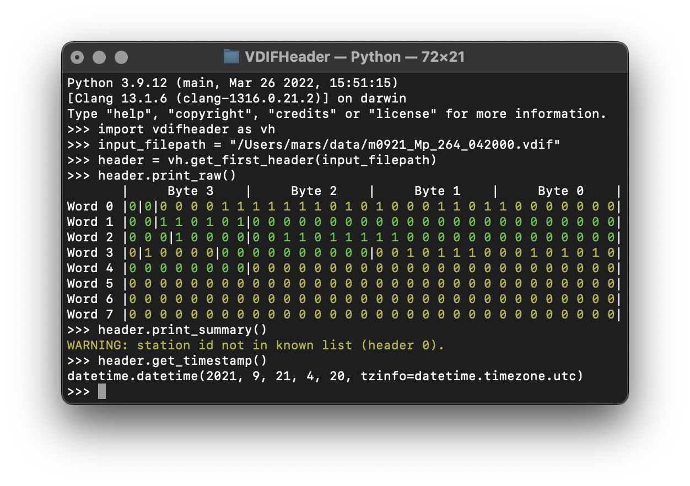

# VDIF Header

> :warning: **WARNING**: This project is in a pre-release state and has not yet achieved test coverage. **Use at your own risk.**
> 
A simple Python library for parsing and validating the format and values of **VDIF**[^1] headers in radio telescope data files.

[^1]: VLBI Data Interchange Format (source: [vlbi.org](https://vlbi.org/wp-content/uploads/2019/03/VDIF_specification_Release_1.1.1.pdf))

## Usage

### As a Package

When imported as a package, users have access to two main functions:

* `get_first_header(input_filepath)` - function returns the first header in the provided file as a `VDIFHeader` object.
* `get_headers(input_filepath, count=None)` - generator function returns the first `count` headers in the provided file, as a **generator** of `VDIFHeader` objects. If `count` is negative, zero or `None`, default behaviour is to parse all headers found in the file. 

Each `VDIFHeader` object is populated with `VDIFHeaderField` objects that hold the `value` and `validity` for each contained property. Validity is always `VALID`, `INVALID` or `UNKNOWN`.

```python
import vdifheader as vh
input_filepath = './some_input_file.vdif'
headers = vh.get_headers(input_filepath, count=5)
for header in headers:
    print(header.print_values())
headers_list = list(headers)
timestamp = headers_list[0].get_timestamp()
print(f"Parsed {len(headers_list)} starting at {timestamp}")
station = headers_list[0].station_id.value
```

### As a Script

When run as a script, simply specify a file to validate and any additional configuration options. Options include:

* show usage/help
* parse only a certain number of headers
* show output in a certain format

```
% python -m vdifheader -h
usage: vdifheader [options] [file]
  options:
    -h, --help		show help
    -n --count [number]	number of headers to parse (default=all)
    -a --all		parse all headers in file
    -v --verbose	show all output
    -s --silent		show minimal output
    -p --print [mode]	level of output to show {none|summary|values|raw|verbose}
%
% python -m vdifheader some_input_file.vdif
WARNING: synch code field contains incorrect value (header 2).
WARNING: synch code field contains incorrect value (header 3).
0 errors, 2 warnings generated.
```

### As an Interactive Script

When passing `-i` to the Python interpreter, the provided script will run but leave the interpreter open afterwards for the user to continue the session with variable memory and declarations intact. In this mode, after completion of the script, the following values will be set:

* `first_header` - the first header parsed from the provided file.
* `headers` - a list of all headers parsed from the provided file.

```
% python -i -m vdifheader --count 5 some_input_file.vdif
WARNING: synch code field contains incorrect value (header 2).
WARNING: synch code field contains incorrect value (header 3).
0 errors, 2 warnings generated.
>>> first_header.station_id
Hb
>>> len(headers)
5
```

For detailed usage information, see the [vdifheader documentation](/docs).

## Dependencies

The only required dependencies are within the Python standard library except for one optional dependency: `colorama`. If installed, this package enables colored debug output.

<p align="center"></p>

## License

This project is licensed under the terms of the [GNU General Public License, version 3](https://www.gnu.org/licenses/gpl-3.0.en.html). **This is a [copyleft](https://www.gnu.org/licenses/copyleft.en.html) license.**

## Planned Improvements

* Handling of Extended Data fields.
* Ability to change values in `VDIFHeader`, write them back to valid binary header.
* Output header values to formats such as iniFile/csv/json.
* Extensible (i.e. define-your-own) field validity constraints.
